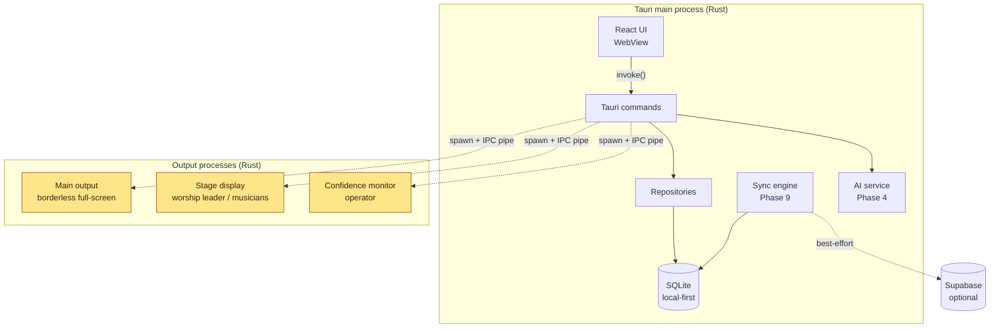
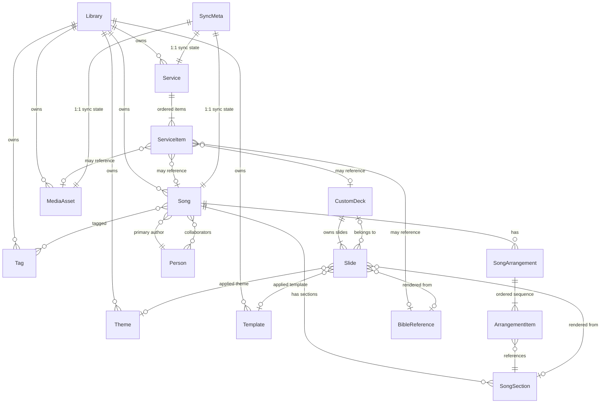

# SundayStage — Architecture

Last updated: 2026-05-27

This document captures the architectural decisions for SundayStage. Pair with `docs/DECISIONS.md` (ADRs) for the _why_ behind specific choices.

## High-level architecture



Yellow = the "sacred" live output processes. Isolated from the UI process. If the
UI crashes, the outputs keep showing the last cue.

## Data model — Entity Relationship Diagram



## Entities

### Library (tenant root)

Container for an entire data set. A user can have multiple libraries (e.g.
"Personal", "Alta Frikirke", "Trondheim Misjonskirken"). Sync is scoped per
library — a library never leaks data across boundaries.

| Column             | Type             | Notes                                    |
| ------------------ | ---------------- | ---------------------------------------- |
| `id`               | TEXT PK          | UUIDv7                                   |
| `name`             | TEXT NOT NULL    |                                          |
| `default_locale`   | TEXT             | `no`, `en`, `sv`, `da`, `de`, `fr`, `pl` |
| `default_theme_id` | TEXT FK Theme    | nullable                                 |
| `created_at`       | INTEGER NOT NULL | unix ms                                  |
| `updated_at`       | INTEGER NOT NULL |                                          |

### Person (composer, lyricist, translator, performer)

Lightweight contact entity. Used for CCLI/TONO reporting and credits.

| Column         | Type            | Notes                                           |
| -------------- | --------------- | ----------------------------------------------- |
| `id`           | TEXT PK         | UUIDv7                                          |
| `library_id`   | TEXT FK Library |                                                 |
| `display_name` | TEXT NOT NULL   | "Brooke Ligertwood"                             |
| `sort_name`    | TEXT            | "Ligertwood, Brooke"                            |
| `external_ids` | TEXT JSON       | `{ "ccli_artist_id": "...", "spotify": "..." }` |

### Song

The conceptual song. May have many arrangements, sections, translations.

| Column                                   | Type            | Notes                                 |
| ---------------------------------------- | --------------- | ------------------------------------- |
| `id`                                     | TEXT PK         | UUIDv7                                |
| `library_id`                             | TEXT FK Library |                                       |
| `title`                                  | TEXT NOT NULL   |                                       |
| `ccli_song_id`                           | TEXT            | nullable; for license reporting       |
| `tono_work_id`                           | TEXT            | nullable; Norwegian rights database   |
| `copyright_notice`                       | TEXT            | "© 2008 Hillsong Music Publishing"    |
| `default_key`                            | TEXT            | `D`, `Am`, `F#`, etc.                 |
| `tempo_bpm`                              | INTEGER         | nullable                              |
| `language`                               | TEXT            | ISO 639-1                             |
| `last_used_at`                           | INTEGER         | denormalized — when last in a service |
| `created_at`, `updated_at`, `deleted_at` | INTEGER         | soft delete                           |

### SongSection

A reusable block of lyrics: verse 1, chorus, bridge, intro, instrumental, tag.

| Column          | Type          | Notes                              |
| --------------- | ------------- | ---------------------------------- |
| `id`            | TEXT PK       | UUIDv7                             |
| `song_id`       | TEXT FK Song  |                                    |
| `label`         | TEXT NOT NULL | `verse_1`, `chorus`, `bridge`, ... |
| `lyrics`        | TEXT NOT NULL | line-separated                     |
| `chord_chart`   | TEXT          | optional ChordPro format           |
| `display_order` | INTEGER       | for the section list editing UI    |

### SongArrangement

An ordered playback sequence of sections. A song can have multiple
arrangements ("Full version", "Short version", "Acoustic").

| Column       | Type          | Notes                     |
| ------------ | ------------- | ------------------------- |
| `id`         | TEXT PK       | UUIDv7                    |
| `song_id`    | TEXT FK Song  |                           |
| `name`       | TEXT NOT NULL | "Full version"            |
| `is_default` | INTEGER       | 0/1, exactly one per song |
| `created_at` | INTEGER       |                           |

### ArrangementItem

Many-to-many: which sections appear, in what order. Same section can appear
multiple times (verse 1 → chorus → verse 2 → chorus).

| Column           | Type                    | Notes        |
| ---------------- | ----------------------- | ------------ |
| `arrangement_id` | TEXT FK SongArrangement | composite PK |
| `position`       | INTEGER NOT NULL        | composite PK |
| `section_id`     | TEXT FK SongSection     |              |

### BibleReference

A scripture passage to display. Cached per translation so we don't need
internet at service time.

| Column                     | Type             | Notes                       |
| -------------------------- | ---------------- | --------------------------- |
| `id`                       | TEXT PK          | UUIDv7                      |
| `book`                     | TEXT NOT NULL    | `John`, `1 Kor`, etc.       |
| `chapter`                  | INTEGER NOT NULL |                             |
| `verse_start`, `verse_end` | INTEGER          |                             |
| `translation`              | TEXT             | `NIV`, `NB-30`, `NLB`, etc. |
| `text`                     | TEXT NOT NULL    | cached verses, line-broken  |

### Service

A planned worship service. Has date, name, notes, ordered items.

| Column                     | Type            | Notes                          |
| -------------------------- | --------------- | ------------------------------ |
| `id`                       | TEXT PK         | UUIDv7                         |
| `library_id`               | TEXT FK Library |                                |
| `name`                     | TEXT NOT NULL   | "Sunday 14 Sept 2026, 11:00"   |
| `starts_at`                | INTEGER         | unix ms                        |
| `notes`                    | TEXT            | sermon outline, technical cues |
| `created_at`, `updated_at` | INTEGER         |                                |

### ServiceItem

Ordered item in a service. Type-discriminated.

| Column                                                              | Type                    | Notes                                                              |
| ------------------------------------------------------------------- | ----------------------- | ------------------------------------------------------------------ |
| `id`                                                                | TEXT PK                 | UUIDv7                                                             |
| `service_id`                                                        | TEXT FK Service         |                                                                    |
| `position`                                                          | INTEGER NOT NULL        |                                                                    |
| `kind`                                                              | TEXT NOT NULL           | `song`, `scripture`, `custom_deck`, `video`, `announcement`, `gap` |
| `song_id`, `bible_reference_id`, `custom_deck_id`, `media_asset_id` | TEXT                    | nullable; exactly one matches `kind`                               |
| `arrangement_id`                                                    | TEXT FK SongArrangement | when `kind=song`                                                   |
| `key_override`                                                      | TEXT                    | when `kind=song` and user transposed                               |
| `notes`                                                             | TEXT                    | per-item notes                                                     |

### CustomDeck

Ad-hoc slide deck not tied to a song or scripture. Announcements, sermon
slides, etc.

| Column       | Type            | Notes  |
| ------------ | --------------- | ------ |
| `id`         | TEXT PK         | UUIDv7 |
| `library_id` | TEXT FK Library |        |
| `name`       | TEXT NOT NULL   |        |
| `created_at` | INTEGER         |        |

### Slide

A rendered screen. Has text/media content plus position/styling.

| Column           | Type               | Notes                                                           |
| ---------------- | ------------------ | --------------------------------------------------------------- |
| `id`             | TEXT PK            | UUIDv7                                                          |
| `custom_deck_id` | TEXT FK CustomDeck | nullable — slides for songs/scripture are generated, not stored |
| `position`       | INTEGER            | within deck                                                     |
| `content`        | TEXT JSON          | text blocks, images, backgrounds (see below)                    |
| `theme_id`       | TEXT FK Theme      | nullable; per-slide override                                    |
| `template_id`    | TEXT FK Template   | nullable                                                        |

`content` JSON shape:

```json
{
  "background": { "type": "color"|"image"|"video"|"gradient", "value": "..." },
  "blocks": [
    {
      "type": "text",
      "text": "Amazing grace, how sweet the sound",
      "x": 0.1, "y": 0.4, "w": 0.8, "h": 0.2,
      "align": "center", "valign": "middle",
      "font": { "family": "...", "size": 64, "weight": 700 },
      "color": "#ffffff",
      "shadow": "0 2px 8px rgba(0,0,0,0.6)"
    }
  ]
}
```

### MediaAsset

Image, video, audio file. Identified by hash for path stability.

| Column            | Type            | Notes                             |
| ----------------- | --------------- | --------------------------------- |
| `id`              | TEXT PK         | UUIDv7                            |
| `library_id`      | TEXT FK Library |                                   |
| `kind`            | TEXT NOT NULL   | `image`, `video`, `audio`         |
| `original_path`   | TEXT NOT NULL   | absolute path at import time      |
| `content_hash`    | TEXT NOT NULL   | sha-256; for relink on path break |
| `thumbnail_path`  | TEXT            | generated by ffmpeg               |
| `width`, `height` | INTEGER         | for images/video                  |
| `duration_ms`     | INTEGER         | for video/audio                   |
| `tags`            | TEXT JSON       | string array                      |
| `imported_at`     | INTEGER         |                                   |

### Theme

A named bundle of typographic + color tokens. Applied at library, song, or
slide level (cascade).

| Column       | Type            | Notes               |
| ------------ | --------------- | ------------------- |
| `id`         | TEXT PK         | UUIDv7              |
| `library_id` | TEXT FK Library |                     |
| `name`       | TEXT NOT NULL   | "Sunday Morning"    |
| `tokens`     | TEXT JSON       | colors, font, sizes |

### Template

A slide layout with named slots. Themes style those slots.

| Column       | Type            | Notes                             |
| ------------ | --------------- | --------------------------------- |
| `id`         | TEXT PK         | UUIDv7                            |
| `library_id` | TEXT FK Library | nullable for built-in templates   |
| `name`       | TEXT NOT NULL   | "Lyrics Centered"                 |
| `slots`      | TEXT JSON       | slot definitions (position, type) |

### Tag

Free-form labels.

| Column       | Type                             | Notes  |
| ------------ | -------------------------------- | ------ |
| `id`         | TEXT PK                          | UUIDv7 |
| `library_id` | TEXT FK Library                  |        |
| `name`       | TEXT NOT NULL UNIQUE per library |        |
| `color`      | TEXT                             | hex    |

### SyncMeta (Phase 9)

One row per syncable entity. Decoupled so the entity tables stay clean.

| Column           | Type    | Notes                                                 |
| ---------------- | ------- | ----------------------------------------------------- |
| `entity_type`    | TEXT    | `song`, `service`, ... composite PK                   |
| `entity_id`      | TEXT    | composite PK                                          |
| `server_id`      | TEXT    | UUID assigned by Supabase                             |
| `updated_at`     | INTEGER | last known server timestamp                           |
| `last_synced_at` | INTEGER | last successful sync                                  |
| `device_id`      | TEXT    | id of device that made last edit                      |
| `conflict_state` | TEXT    | `none`, `local_diverged`, `server_diverged`, `manual` |

## Hardest queries — does the model support them?

### Q1: Cross-library lyric search

> "Find me all songs in my libraries with the phrase 'amazing grace' in the lyrics."

```sql
SELECT s.* FROM song s
JOIN song_section ss ON ss.song_id = s.id
WHERE s.deleted_at IS NULL
  AND s.library_id IN (?, ?, ?)
  AND ss.lyrics MATCH 'amazing grace'    -- FTS5
ORDER BY s.last_used_at DESC NULLS LAST
LIMIT 50;
```

Supported by FTS5 virtual table mirroring `song_section.lyrics`. Triggers
keep the FTS index in sync on insert/update/delete.

### Q2: Compile a CueList for a Service

> "I want the flat ordered list of slides for tonight's service."

```sql
-- Service items in order
WITH items AS (
  SELECT * FROM service_item WHERE service_id = ? ORDER BY position
)
-- For each song item, materialize its arrangement → sections → slides
-- For each scripture item, materialize verses → slides
-- For each custom_deck item, fetch deck slides
-- Concatenate in order
```

This is best handled in Rust, not SQL. The repository assembles the
service items, then each item type has a `to_slides()` method. The result
is the in-memory CueList for the live engine.

### Q3: "Songs we used in the last 8 weeks"

> Used for the variety scoring engine.

```sql
SELECT s.* FROM song s
WHERE s.library_id = ?
  AND s.last_used_at > ? -- now - 8 weeks
  AND s.deleted_at IS NULL;
```

Trivial — `last_used_at` is denormalized for this exact query. Updated by
a trigger when a service that contains the song is marked `played` (Phase 5).

### Q4: Path-broken media auto-relink

> "MediaAsset.original_path no longer exists. Find by hash in common locations."

This is a Rust-level scan, not SQL. The repository exposes
`find_by_hash(hash, search_paths)` which walks the user's media folder,
SundayRec recordings folder, cloud-sync folder. Hash is the key — fast
because we hash on import and store.

### Q5: Templates × Themes cascade

> "Render slide S with its effective theme."

```
slide.theme_id ?? song.theme_id ?? library.default_theme_id ?? builtin_default
slide.template_id ?? song.template_id ?? library.default_template_id ?? builtin_default
```

Implemented in `services::theme::{resolve_theme_id, resolve_template_id}`
(Phase 3.2) — pure functions over the precedence chain that always yield a
concrete id (final fallback = built-in default), plus `tokens_for`/`layout_for`
that degrade a dangling id to the default rather than blanking the screen.
The bugs hide here, so it has its own unit-test suite. `render_slide` then
turns a resolved template+theme into the Phase 3.1 `SlideDoc`, so editor
preview and the live engine paint from one code path.

## Why these decisions

### SQLite over SurrealDB / DuckDB / Postgres-local

- Battle-tested. Every operating system runs it. The application database
  has no external dependencies.
- WAL mode for concurrent readers + single writer is plenty for this
  workload.
- Supabase Postgres later (cloud sync) is a _separate_ store, not a primary.

### UUIDv7 over INTEGER autoincrement

- Sortable by time without leaking creation order across devices.
- Stable across sync — no "id conflicts" between offline devices.
- 26-character text — small enough overhead.

### Unix milliseconds over `TEXT` ISO timestamps

- Easier arithmetic, smaller storage, no timezone bugs.
- Renderer formats for display.

### Soft delete

- Service history must outlive deletes. A song deleted in 2027 but used in
  a 2025 service must still show up correctly in archived service detail.
- Sync needs to propagate deletes anyway; `deleted_at IS NOT NULL` is
  cleaner than tombstone tables.

### `tono_work_id` first-class

- Norway-specific. Required for the Sunday-suite TONO-reporting story (see
  `sundaysong-claude-code-plan.md` Phase 7.2). Nullable because most
  imports won't have it.

### Theme + Template as separate entities

- Theme = colors/fonts. Template = layout/positions. Orthogonal — the
  same "Lyrics Centered" template should look right with any theme.
- Built-in templates have `library_id = NULL`. Per-library customizations
  copy the built-in into the library.

## Process model — main + output isolation

Detailed in Phase 5.2 of the build plan. Summary:

- **Main app** (this Rust crate): UI, library editor, service planning,
  AI, sync.
- **Output processes** (`sundaystage-output` binary, separate cargo target
  added in Phase 5.2): one per active display. Spawned when "Go Live" is
  pressed. Each renders to a borderless full-screen window on its assigned
  display.
- **Transport**: Tauri local IPC (named pipes on Windows, Unix sockets on
  Mac). Decided in Phase 5.2.
- **Watchdog**: main sends heartbeat every 250 ms. Output kills the
  connection if no heartbeat for 2 s, but **keeps showing the last slide**.
  The congregation never sees an error screen.

## Phase status (May 2026)

- [x] Phase 0 — Scaffolding (Tauri 2 + React + TS + Tailwind v4 + tokens)
- [x] Phase 1.1 — Data model + ERD (this document)
- [ ] Phase 1.2 — Rust data layer (in progress)
- [ ] Phase 1.3 — IPC + state management
- [ ] Phase 2 — App shell + library
- [x] Phase 3 — Slide editor (3.1 canvas + 3.2 themes/templates/cascade + 3.3 song structure)
  - 3.1: typed `SlideDoc` model, `DeckRepo`, direct-manipulation canvas with snap guides, multi-select, command-pattern undo/redo
  - 3.2: `services::theme` (built-in themes/templates, cascade resolution, render bridge), `ThemeRepo`, per-slide/song/library overrides (migration 0002), editor theme/template pickers + live token editor
  - 3.3: section editor + `ArrangementRepo` (ordered, repeatable section sequences, multiple arrangements/song), cue compiler now resolves `service_item.arrangement_id`, `SongEditor` UI (sections + arrangement builder + generated-slide preview)
- [~] Phase 4 — AI lyric formatter (4.1 service layer + 4.2 lyric formatting done; streaming UI, keychain key storage, consent dialog, embeddings pending)
  - 4.1: `services/ai` — `AiProvider` trait, `ClaudeModel` register + pure cost estimate, pure Messages request builder + tool-use response parser, `AnthropicProvider` behind optional `ai` cargo feature (default build falls back to local heuristic)
  - 4.2: `services/ai/lyric_format` — `FormattedSong` model, system prompt + tool schema, validated response parser, pure `heuristic_format` offline fallback (chord/marker stripping, header detection, chorus-repeat collapse, language guess), `apply_formatted_song` → sections + arrangement. `PasteFormatModal` UI
- [x] Phase 5 — Live engine + output isolation (5.1 compiler + runtime, 5.2 real isolated output processes, 5.3 operator console — all done; per-display drag-drop layout builder is the only deferred sub-item)
  - 5.1: `services::cue_list` compiler + `services::live_session` runtime (single dispatcher, output state, session log, crash-recovery persistence). Live commands (`live_start`/`live_dispatch`/`live_state`/`live_end`), session held in `AppState`. The compiler resolves the theme/template cascade and embeds the concrete look on each cue (audit 2c)
  - 5.2: **REAL crash isolation** — `output` module `OutputMessage`/`OutputAck` wire protocol + `Watchdog` (hold-last-frame on heartbeat loss) + `output::ipc` local transport (Unix socket / Windows named pipe) + the spawned `sundaystage-output` binary (windowed, or `--headless` for CI) supervised by `output::process`. `tests/output_isolation.rs` drives the real spawned binary over the real socket, proves it survives parent death and is restarted by the supervisor. Only actual fullscreen pixels on a second monitor need a rig test.
  - 5.3: operator console (`LivePreview`) — cue list (current+next), live-output preview, coming-next preview, notes, next-cues filmstrip, ⌘J fuzzy quick-jump, hotkeys, output-health placeholder
- [~] Phase 6 — Reliability + stress testing (6.1 crash recovery + 6.2 data/runtime stress done; Sentry crash-reporting + GUI/Playwright stress + output-process beep/badge deferred)
  - 6.1: `services::session_store` append-only JSONL write-ahead log (header + one line per action, crash-safe; skips a torn trailing line), `live_recover` + relaunch resume flow (`RecoveryBanner`), crash detection via leftover log. Watchdog (5.2) + 400ms slide autosave (3.1) already in place
  - 6.2: `tests/stress.rs` harness — FTS search over 3000 songs (~2ms), 50 cue advances over an 800-cue list (~180µs), 240-slot arrangement resolve (~3ms). Run with `cargo test --test stress`
- [~] Phase 7 — Bible + media (7.1 bible done; 7.2 path-stability core + browser done — thumbnails/ffprobe, native file-dialog, background library, in-slide video playback deferred)
  - 7.2: `services::media` content fingerprint (O(1) size+head+tail, no ffmpeg) + `find_by_fingerprint` relink search + `detect_kind`; `MediaRepo` import/get/delete/relink; commands (`media_import`/`media_list`→present-flagged `MediaStatus`/`media_delete`/`media_relink`); `MediaPage` grid with type filter, broken-path badge, hash relink
- [~] Phase 8 — Stage display (presets + in-app stage view done; per-screen window assignment + drag-drop layout builder deferred with the 5.2 output process)
  - `services::stage_display` `StageDisplayConfig` + 3 built-in presets (Worship Leader / Musician / Pastor), `stage_presets` command; `LiveSessionView.started_at` for the service timer; `StageDisplay` full-screen view (current lyrics big, next, section label, clock + service timer, notes) toggled from the operator console, preset-switchable
- [~] Phase 9 — Cloud sync + collaboration (conflict/gate/status engine done; Supabase backend, auth, outbox/inbox transport, realtime presence + team collab deferred)
  - 9.1 core: `services::sync` — pure `resolve` (LWW + conflict flagging), `should_sync` gate (never sync during a live service — the plan's critical constraint), `compute_status` → `SyncStatus` (local_only/synced/syncing/offline/conflict/paused_live); `sync_status` command (reads the live session) + a Sidebar indicator (currently "Lokal", free tier is fully local)
- [~] Phase 10 — SundayRec integration (protocol design + marquee transforms done; loopback transport/discovery/pairing + TONO audit deferred — need a live network + peer app)
  - 10.1: `services::sundayrec_bridge::protocol` versioned `BridgeRequest`/`BridgeResponse` (ping/recording_started/stopped/cue_advanced/get_recordings/get_transcript/get_song_history, v1.0.0), `docs/SUNDAY_BRIDGE_PROTOCOL.md`
  - 10.2: `services::sundayrec_bridge::export` — pure `chapter_markers` (cue→chapter, item-grouped, blackout-safe) + `session_to_srt` (lyrics→SRT, timeline-anchored, gap/coalesce-aware) over the live session log; `bridge_chapter_markers`/`bridge_export_srt` commands + `ExportModal` (chapters + SRT preview, copy)
- [~] Phase 11 — Power AI features (11.2 service-planning assistant + live translation overlay done; 11.1 semantic search deferred)
  - 11.2 (planning): `services::ai::plan` — `ServicePlan`/`PlanItem`, library-aware prompt + tool schema, `parse_plan_response` (validates song picks against the library, downgrades unknowns to notes), `apply_plan` → real `Service` + `ServiceItem`s (`ServiceRepo::add_item`); `ai_plan_service`/`ai_apply_plan` commands; `PlanModal` from the library header
  - 11.2 (translation overlay): a per-service `secondary_language` (set in the queue editor header → `service_set_secondary_language`). The cue compiler PRE-RESOLVES every distinct slide line at "Go Live" time (`CueCompiler::resolve_translations`) so the live output never makes a network call: cache (`translation_cache` via `TranslateRepo`) → bundled public-domain Bible text (`translate::bundled_verse_translation`, keyless) → Anthropic API (only with a key, results cached). The resolved lines ride on `SlideContent.translation_lines` (1:1 with `text_lines`); `SlideView` + `StageDisplay` render each translated line under its primary. Keyless = cached/bundled still render, un-cached lines simply get no secondary line, never a crash.
  - Deferred: 11.1 semantic search (needs embeddings/pgvector)
- [→] Phase 12 — Companion (follow-along) — SUPERSEDED by **SundayStage Web** (`stage.sundaysuite.app`): a Cloudflare-hosted Next.js app where phones and extra screens join a session by 6-digit code and follow over Supabase broadcast (<1 s). The desktop forwards frames to it via the (pending) `webShare` hook. The in-repo `companion/` static PWA is deprecated — see `companion/README.md`.
- [~] Phase 13 — Polish + launch (13.1 onboarding + i18n machinery + demo content done; full string retrofit, sv/da/de/fr/pl translation, tutorial, 13.2 distribution/auto-update, 13.3 landing site deferred — see docs/LAUNCH_READINESS.md)
  - 13.1: `services::demo` seed_demo_content (3 PD songs + arrangements + KJV scripture + welcome deck + a playable Welcome Service) + supported locales; `services` onboarding commands; `lib/i18n.ts` (catalog + `t()` + persisted locale store), `WelcomeScreen` first-run flow, nav/chrome wired through `t()`
